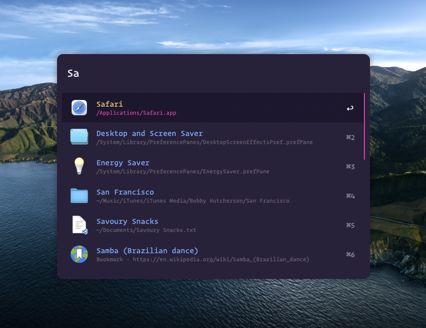
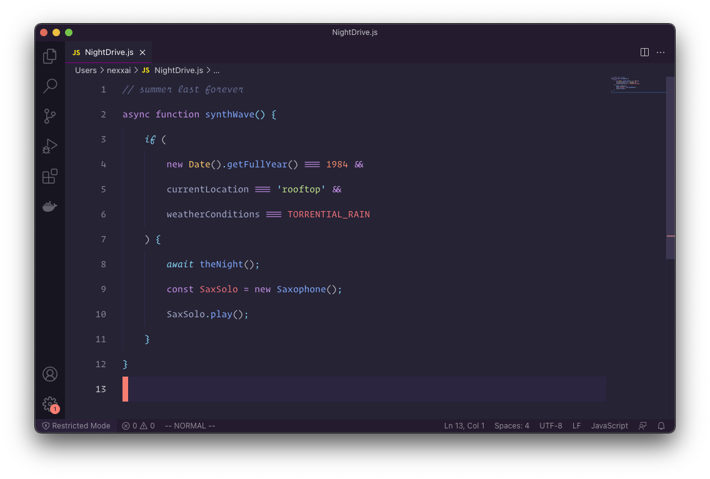

# Material Synthwave Alfred Powerpack Theme

Here is an [Alfred Powerpack Theme](https://www.alfredapp.com/help/appearance/) based on my [Material Synthwave VSCode theme](https://github.com/nexxai/material-synthwave-vscode) "a very simple and probably visually not-so-great mash-up of Robb Owen's SynthWave '84 window coloring and equinusocio's Material Theme font colorings." and [Chris Messina's Synthwave '84](https://github.com/chrismessina/alfred-theme-synthwave-84).

  <a href="https://github.com/nexxai/material-synthwave-alfred/raw/main/material-synthwave.zip" class="button">
    Download Theme
  </a>

## Installation

Download the zip file below, unzip the file, and then double-click the `.alfredappearance` file to install it.

This theme makes use of Hoefler & Co's [Operator Mono](https://www.typography.com/blog/introducing-operator) font.

## Preview

  <a href="https://github.com/nexxai/material-synthwave-alfred/raw/main/material-synthwave.zip" class="button">
    Download Theme
  </a>

## Suggested configuration

Disable the Alfred hat logo by checking: `Alfred Preferences › Appearance › Options › Hide hat on Alfred window`

Simplify results by switching the result subtext to "Only for Alternative Actions".

## Inspiration

### VS Code Theme

